# EXAMEN
#Examen Final – Arte Cinético Interactivo 

##Descripción del proyecto

Este proyecto es una experiencia interactiva desarrollada en p5.js e inspirada en el arte cinético. La idea fue crear una composición visual que cambiara constantemente según las acciones del usuario, utilizando el movimiento del mouse y algunas teclas del teclado para modificar la animación en tiempo real.

El proyecto está dividido en tres pantallas. Primero aparece una portada de bienvenida, luego una visualización interactiva donde el usuario puede explorar distintos efectos visuales y, finalmente, un pequeño minijuego que pone a prueba la interacción con los elementos que aparecen en pantalla.

El objetivo fue combinar programación, diseño e interactividad para crear una experiencia visual dinámica donde el usuario no solo observa la obra, sino que también influye en cómo se desarrolla.

##Objetivo

Desarrollar una experiencia interactiva utilizando p5.js, explorando los principios del arte cinético mediante animaciones, movimiento e interacción con el usuario, integrando tanto elementos visuales como un pequeño desafío final.

##Idea central

La propuesta busca demostrar cómo figuras geométricas simples pueden transformarse en una composición dinámica cuando responden al movimiento del usuario. A través del mouse y del teclado, la visualización cambia constantemente, haciendo que cada interacción genere un resultado distinto.
Además de la parte visual, el proyecto incorpora un minijuego que cambia el ritmo de la experiencia y hace que el usuario participe de una forma más activa.

##¿Qué se ve en pantalla?
###Pantalla 1 – Inicio

La primera pantalla funciona como una introducción al proyecto. Tiene un fondo amarillo y una serie de elipses que se desplazan horizontalmente por uno de los costados, generando movimiento desde el comienzo. En el centro aparecen los textos "LET'S BEGIN" y "Press ENTER", indicando cómo iniciar la experiencia.

###Pantalla 2 – Visualización interactiva
Aquí el usuario puede mover el mouse para modificar la composición visual, cambiar entre dos modos de visualización, mostrar u ocultar un GIF con la barra espaciadora y generar una cantidad distinta de figuras de manera aleatoria.

Dependiendo del modo seleccionado, las figuras se representan mediante líneas que siguen el movimiento del cursor o mediante círculos cuyo tamaño cambia según la posición horizontal del mouse.
Si el usuario mantiene presionado el mouse, aparecen puntos negros sobre las figuras, agregando una nueva capa visual a la composición.

###Pantalla 3 – Minijuego
En esta última pantalla aparecen ocho elipses distribuidas aleatoriamente y de distintos tamaños.
El desafío consiste en hacer clic desde la elipse más grande hasta la más pequeña. Cada selección correcta rellena la figura de color negro. Una vez completada la secuencia, aparece la pantalla de Game Over, desde donde el usuario puede volver al inicio presionando ENTER.

###Elementos visuales utilizados

Para construir la composición se utilizaron recursos gráficos simples, priorizando el movimiento y el contraste.
Fondo amarillo.
Tipografía personalizada.
GIF circular.
Líneas.
Elipses y círculos.
Movimiento orbital.
Animaciones continuas.
Figuras generadas de forma repetitiva mediante programación.
Composición basada principalmente en blanco y negro.

##Sistema de interactividad

El proyecto utiliza dos tipos de interacción.
Interacción continua

##El mouse modifica constantemente la visualización.
Se utilizan:

mouseX
mouseY
mousePressed()
Estas variables permiten cambiar el tamaño de las figuras, la dirección de las líneas y agregar puntos negros cuando el usuario mantiene presionado el mouse.

##Datos de entrada

El sistema recibe información a través de:
Movimiento del mouse.
Clic del mouse.
Teclas ENTER, SPACE, R y Q.
Estas entradas modifican el comportamiento de la animación y permiten avanzar entre las distintas pantallas del proyecto.

##Recursos de programación utilizados

Para desarrollar el proyecto se utilizaron distintos conceptos vistos durante el curso:
Variables.
Condicionales.
Ciclos for.
Funciones propias.
Eventos del teclado.
Eventos del mouse.
Arreglos.
Objetos.
map().
random().
cos().
sin().
dist().
Multimedia (GIF y tipografía personalizada).

##Marco conceptual

El proyecto está inspirado en el arte cinético, una corriente artística donde el movimiento es parte fundamental de la obra. En este caso, el movimiento no solo proviene de la animación programada, sino también de la interacción del usuario.
La programación permite que la composición cambie constantemente, haciendo que la experiencia sea distinta según cómo el usuario se relaciona con ella. De esta manera, la obra deja de ser una imagen estática y pasa a convertirse en una experiencia interactiva.

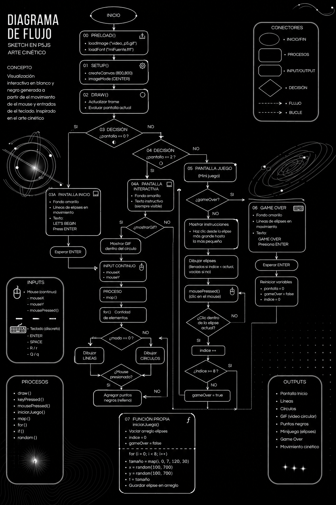

##Conclusión

Este proyecto permitió integrar programación, diseño e interacción en una sola experiencia. A partir de elementos gráficos simples fue posible construir una composición que cambia constantemente según las acciones del usuario.
La incorporación de distintos estados, un GIF, animaciones y un minijuego hace que la experiencia evolucione durante su ejecución, mostrando cómo p5.js puede utilizarse como una herramienta para desarrollar proyectos interactivos inspirados en el arte cinético.

##PROCESO 

Hay capturas de pantalla pero también explicare mi proceso de manera escrita (En los comentarios de las capturas hay parte de el proceso)
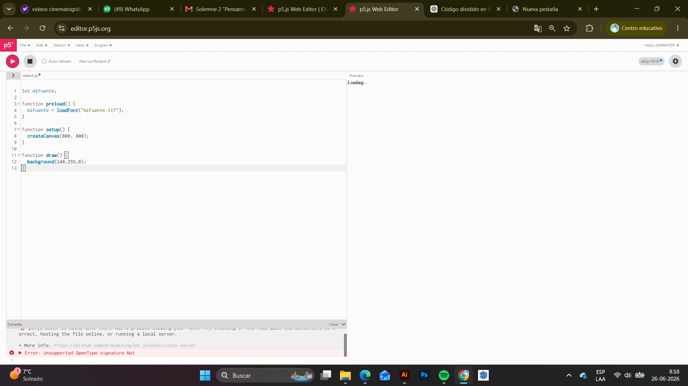 El primer paso que tomé fue cargar la fuente de texto que utilicé antes de el "create canvas" 

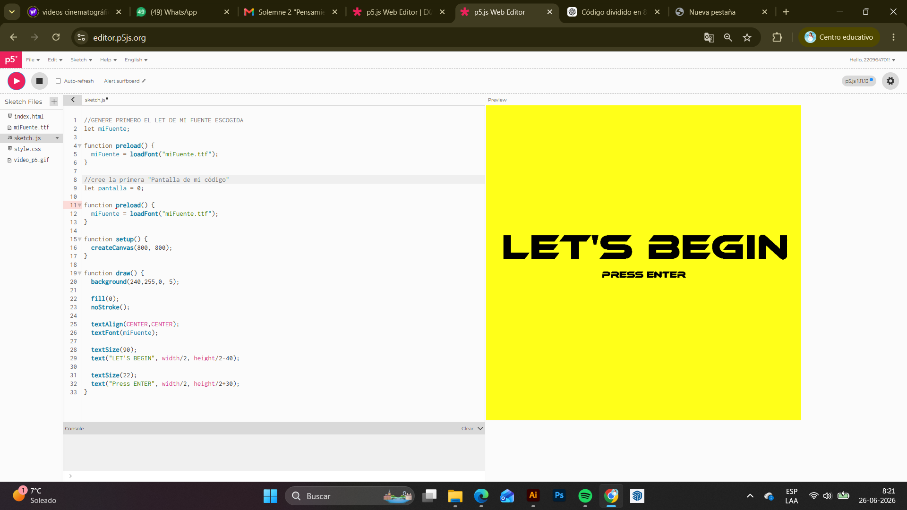 El segundo paso también fue bastante sencillo, ya que simplemente cree la pantalla inicial de mi "Juego" seteando un color de fonfo con "background" y centrando las primeras indicaciones a seguir con la tipografía previamente descargada

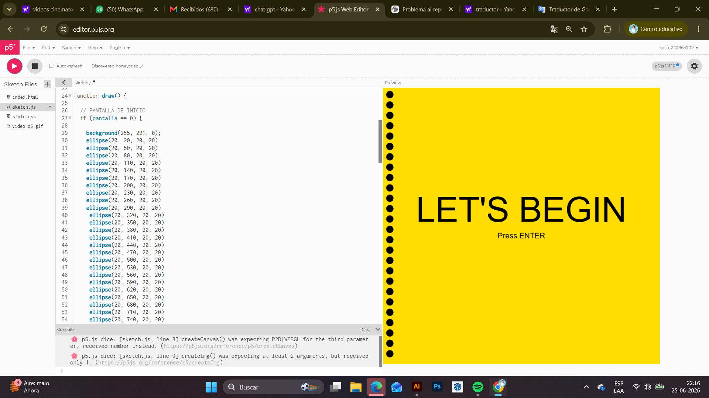 En el siguiente paso tomé el paso bastante largo y generé todos los ellipses que quería que se movieran a mano 

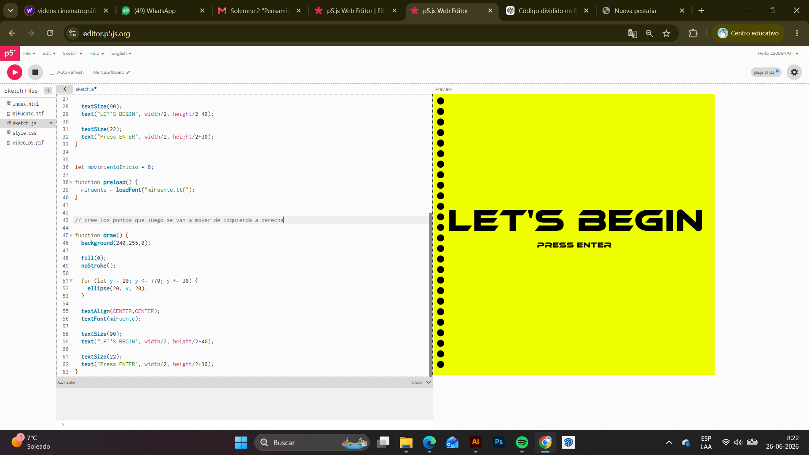 El paso 3 me di cuenta que con "for" "let" podía lograr lo mismo sin necesidad de generar los ellipses a mano y moverlos individualmente

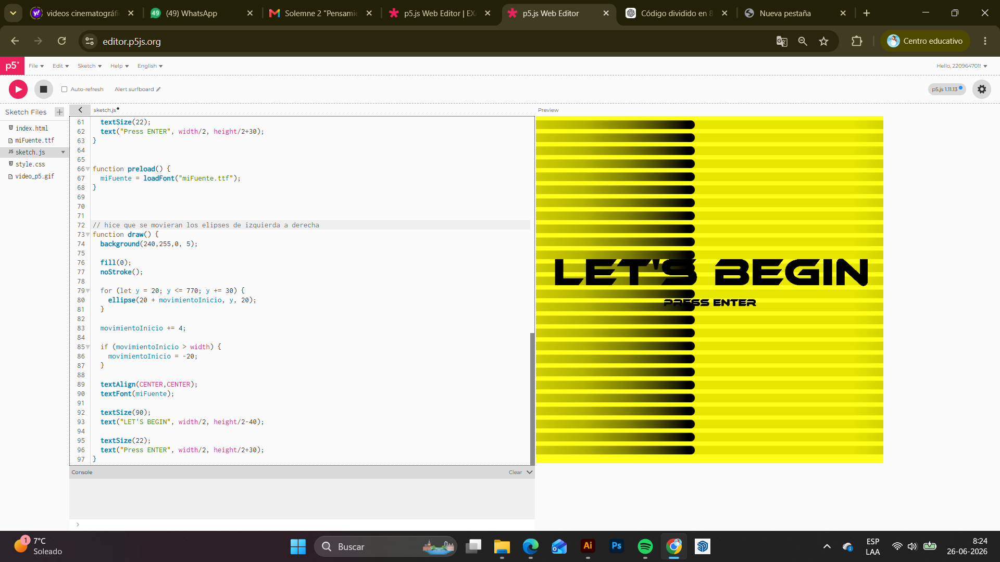 Con "movimientoInicio += 4;" logré que con cada vez que se ejecuta "draw" los círculos se muevan horizontalmente 4 pixeles y para hacer que se muevan todos juntos utilicé "ellipse(20 + movimientoInicio, y, 20);" que hace que este loop se mueva junto y por último la variable "if" hace que este movimiento se repita una vez llegue a su destino final que es el borde derecho

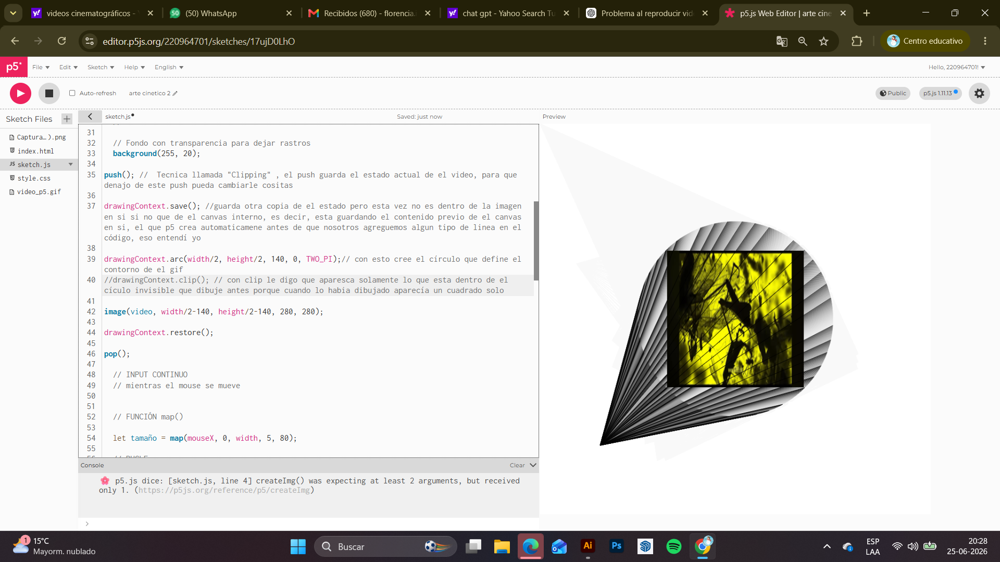 Este paso fue de prueba quize utilizar "push" para guardar en video hasta que entendí que "drawingcontext.save" cumplia una funsión similar de gusrdar este estado para luego restaurarlo y que los cambios como ese cículo invisible en donde solo dejaba ver lo que estaba dentro de este no afectara las pantallas siguientes, todo esto también gracias a la funsión de "drawingcontext.restorer" el cual restaura el estado normal de el canva luego de que esta acción suceda 

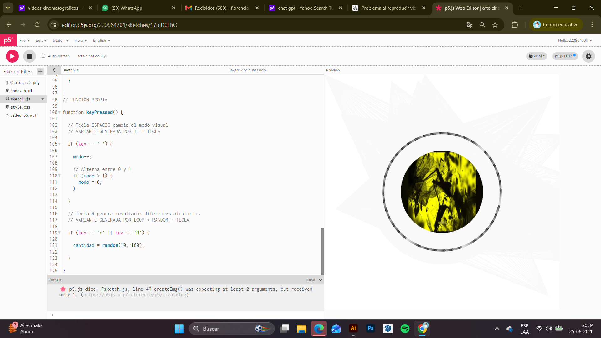 Esta es la demostración de el gif utilizado ya formado 

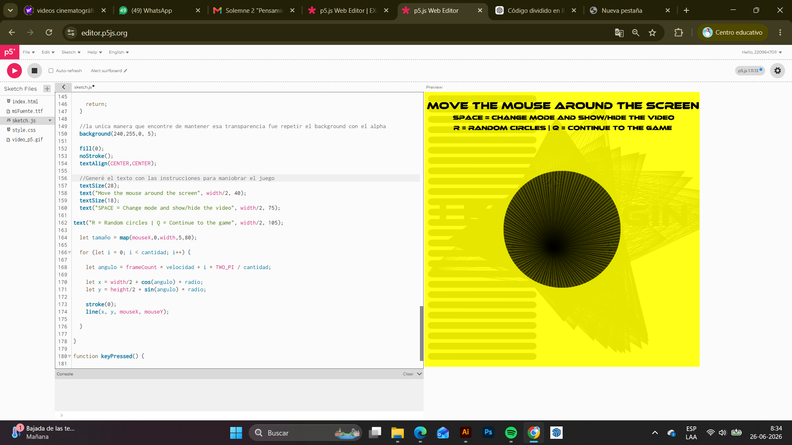 aquí reutilicé la figura que había creado en la segunda solemne para contener el gif, pero le agregue las instrucciónes para continuar con el juego y mantuve el mismo fondo

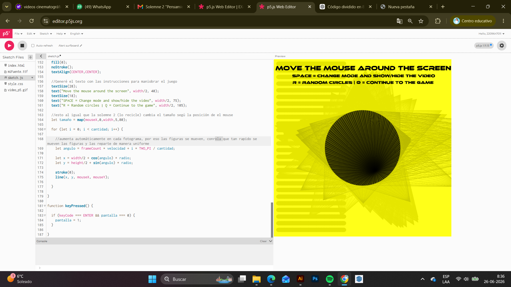 En este paso dejo que los "let" controlen la velocidad y cantidad de franjas provenientes de el elipse, también para lograr esto use "framecount" que va aumentando las figuras en cada frame y las reparte de manera uniforme 

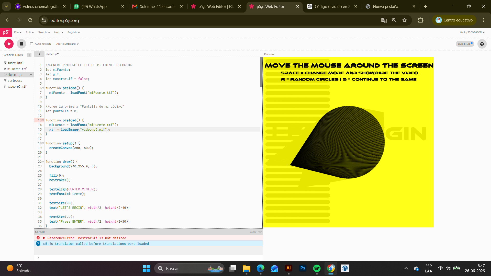 un poco más de la pantalla 2 antes de la variación que ocurre al apretar la tecla espacio 

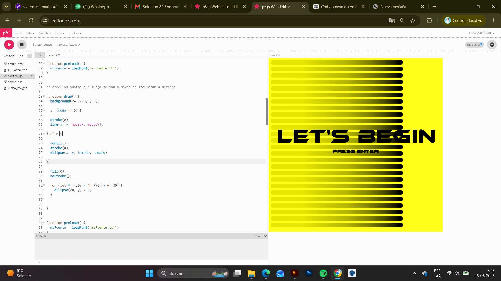 aqui hice algunos ajustes a la pantalla de inicio como bajar el dígito de "alpha" para lograr una transparencia más fluida 

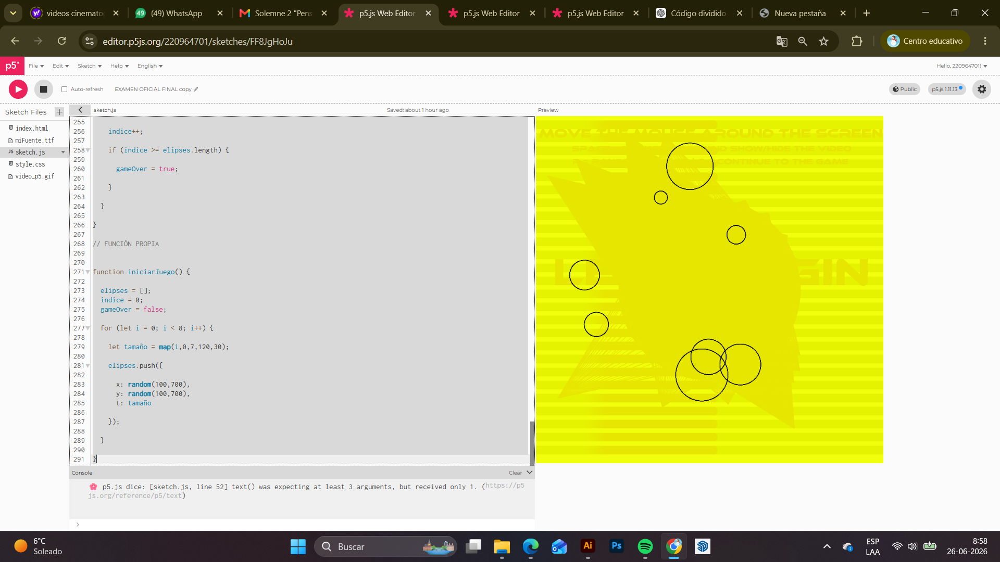 Estos círculos se generan gracias a un ciclo "for", que repite el dibujo varias veces para crear muchas figuras al mismo tiempo. Su posición se calcula con las funciones "cos()" y "sin()", lo que hace que se distribuyan formando un círculo alrededor del centro de la pantalla. Además, como el ángulo cambia constantemente con "frameCount", las figuras parecen girar de forma continua. Finalmente, utilicé "map()" para que el tamaño de los círculos cambie según la posición del mouse, haciendo que la visualización sea interactiva.

